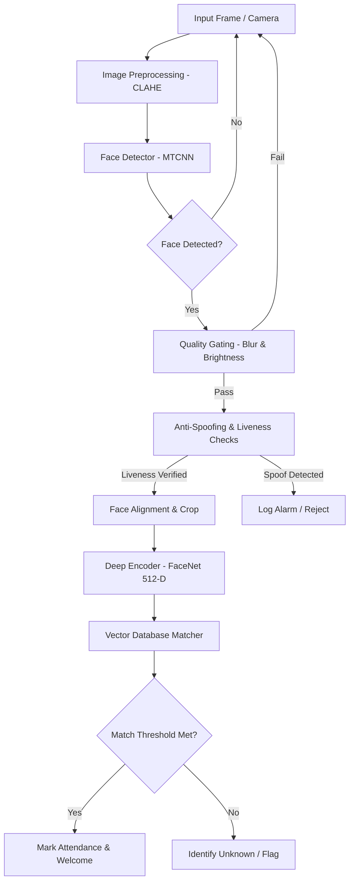

# System Reference Manual & Architecture Documentation
## Face Recognition Management System (FRMS)

This document provides a detailed theoretical and technical breakdown of the **Face Recognition Management System (FRMS)**, outlining the algorithms, deep learning models, pipelines, database architecture, and multi-role web platform implementation.

---

## 1. System Architecture Overview

The system processes raw visual inputs (webcam streams or uploaded image assets) through a multi-stage validation, neural embedding, and vector search pipeline before writing state updates to the relational database.



---

## 2. Core Technology Stack & Dependencies

The following table summarizes the technological components, libraries, and their usage in the codebase:

| Technology | Domain | Usage & Implementation |
|---|---|---|
| **Python 3.x** | Language | Core runtime environment, scripting, and pipeline execution. |
| **Streamlit (>= 1.28)** | User Interface | Role-based dashboard interfaces (Attendance, Kiosk, Staff, Admin) with dynamic Light/Dark CSS override state machine. |
| **PyTorch & Torchvision** | Deep Learning Backend | Tensor operations, mathematical helpers, and GPU/CPU hardware acceleration orchestration. |
| **facenet-pytorch** | Computer Vision Models | Provides pre-trained MTCNN (Multi-task Cascaded Convolutional Networks) for detection and InceptionResnetV1 (FaceNet) for encoding. |
| **OpenCV (opencv-python)** | Image Processing | Webcam frame capture, real-time image resizing, color conversion (BGR to RGB), bounding box drawing, and image sharpening algorithms. |
| **SQLite (sqlite3)** | Vector & Relational Storage | Persistent disk storage for registered persons, 512-dimensional BLOB vector embeddings, and attendance logs. |
| **Pandas** | Data Analytics | Formatting query results, generating system performance reports, and structuring CSV exports. |
| **NumPy & SciPy** | Matrix Mathematics | Vector normalization, distance calculation, local binary pattern matrices, and statistical aggregations. |

---

## 3. Theoretical & Technical Deep Dive

### 3.1. Image Preprocessing (CLAHE)
Under ambient lighting conditions, raw face crops often suffer from deep shadows or oversaturation. To solve this, the pipeline applies **Contrast-Limited Adaptive Histogram Equalization (CLAHE)**:
- **Theory**: Standard histogram equalization stretches the dynamic range of an entire image globally, which often amplifies noise in dark areas. CLAHE operates on localized tiles (typically $8 \times 8$ pixels). It computes the histogram for each tile, limits the contrast magnification by clipping the histogram at a predefined limit (e.g. $2.0$), and redistributes the clipped pixels before using bilinear interpolation to eliminate artificial boundary edges.
- **Color Preservation**: Equalizing RGB channels directly distorts face hues. Thus, the image is converted to the **LAB color space**, where the $L$ (Lightness) channel is equalized, while the $A$ and $B$ (color chrominance) channels are preserved before converting back to RGB.

#### Code Implementation (`src/preprocessor.py`):
```python
def _apply_clahe(self, img_array: np.ndarray) -> np.ndarray:
    """
    Apply CLAHE to normalize contrast.
    Uses LAB color space:
    - L (Lightness) channel gets CLAHE equalization
    - A and B (color) channels are preserved
    This normalizes lighting without changing colors.
    """
    # Convert RGB to LAB color space
    lab = cv2.cvtColor(img_array, cv2.COLOR_RGB2LAB)
    
    # Apply CLAHE to L channel only
    lab[:, :, 0] = self.clahe.apply(lab[:, :, 0])
    
    # Convert back to RGB
    result = cv2.cvtColor(lab, cv2.COLOR_LAB2RGB)
    return result
```

---

### 3.2. Face Quality Gating
To prevent blurry or badly illuminated photos from corrupting the database or causing false recognitions, frames must pass three checks:
* **Blur Assessment (Laplacian Variance)**: The image is convolved with a Laplacian kernel:
  $$K = \begin{bmatrix} 0 & 1 & 0 \\ 1 & -4 & 1 \\ 0 & 1 & 0 \end{bmatrix}$$
  The variance of the resulting response is calculated. Sharp edges yield high variance, while blurred images yield low variance.
* **Brightness Constraints**: Computes the mean intensity values across all color channels. Frames with average brightness below `40` (too dark) or above `220` (too bright) are filtered out.
* **Resolution Gate**: Requires detected faces to be at least $80 \times 80$ pixels to ensure enough spatial detail exists for neural feature mapping.

#### Code Implementation (`src/quality.py`):
```python
def _check_blur(self, gray: np.ndarray) -> float:
    """
    Detect blur using Laplacian variance.
    The Laplacian operator highlights edges. Sharp images have
    strong edges (high variance). Blurry images have weak edges
    (low variance).
    """
    laplacian = cv2.Laplacian(gray, cv2.CV_64F)
    return float(laplacian.var())

def _check_brightness(self, gray: np.ndarray) -> float:
    """Check average pixel intensity (0-255)."""
    return float(np.mean(gray))
```

---

### 3.3. Anti-Spoofing & Liveness Audit
To prevent spoofing attacks (e.g. holding up a printed photo or playing a video on a mobile screen), two liveness checks are executed:
* **Micro-texture Analysis (Local Binary Patterns - LBP)**: Evaluates high-frequency surface textures. Real human skin exhibits soft, continuous gradient shifts, whereas printed paper contains dot-matrix patterns and microscopic grain. LBP labels every pixel by thresholding its $3 \times 3$ neighborhood against the center value and representing the result as a binary number.
* **Color Distribution signature**: Analyzes skin chrominance in the YCrCb color space to detect LCD/monitor screen emission spectrums.

#### Code Implementation (`src/anti_spoof.py`):
```python
def _analyze_texture(self, img: np.ndarray) -> float:
    """
    Analyze micro-texture using Local Binary Patterns (LBP).
    Returns a normalized texture score (0-1). Higher = more likely real.
    """
    gray = cv2.cvtColor(img, cv2.COLOR_RGB2GRAY)
    h, w = gray.shape
    lbp = np.zeros((h - 2, w - 2), dtype=np.uint8)
    
    # 3x3 LBP Neighborhood shift computation
    for i in range(1, h - 1):
        for j in range(1, w - 1):
            center = gray[i, j]
            code = 0
            code |= (gray[i-1, j-1] >= center) << 7
            code |= (gray[i-1, j  ] >= center) << 6
            code |= (gray[i-1, j+1] >= center) << 5
            code |= (gray[i  , j+1] >= center) << 4
            code |= (gray[i+1, j+1] >= center) << 3
            code |= (gray[i+1, j  ] >= center) << 2
            code |= (gray[i+1, j-1] >= center) << 1
            code |= (gray[i  , j-1] >= center) << 0
            lbp[i-1, j-1] = code
    
    # Compute normalized histogram entropy (uniformity check)
    hist, _ = np.histogram(lbp.ravel(), bins=256, range=(0, 256))
    hist = hist.astype(float) / hist.sum()
    hist = hist[hist > 0]
    entropy = -np.sum(hist * np.log2(hist))
    return min(1.0, entropy / 6.0)
```

---

## 4. Vector Database & Matching Strategies

Because we are storing face signatures as raw 512-D vectors, the matching strategy determines how we query a new face embedding against the registered database:

### 4.1. Similarity Metrics
* **Cosine Similarity**: Measures the cosine of the angle between two vectors, ranging from $-1.0$ (opposite direction) to $1.0$ (identical direction). Since embeddings are L2-normalized, Cosine Similarity simplifies to a dot product:
  $$\text{Similarity}(\vec{u}, \vec{v}) = \vec{u} \cdot \vec{v}$$
* **Euclidean Distance**: Measures the straight-line distance between two points in a 512-D space:
  $$d(\vec{u}, \vec{v}) = \sqrt{\sum_{i=1}^{512} (u_i - v_i)^2}$$

### 4.2. Max Individual Matching Strategy
* Stores all registered face embeddings independently.
* During matching, compares the query vector against *every single stored vector* in the database, and assigns the match to the person who holds the single highest similarity score. This is highly robust to variations in camera angle, lighting, and expressions because average vector representation centroids tend to dampen localized facial features.

#### Code Implementation (`src/recognizer.py`):
```python
def _match_max_individual(self, query: np.ndarray, registered: list) -> dict:
    """
    Compare query against ALL individual embeddings per person.
    Return the person whose BEST-MATCHING embedding has the highest score.
    """
    best_name = "Unknown"
    best_score = 0.0
    
    for person in registered:
        for emb in person["embeddings"]:
            if config.DISTANCE_METRIC == "cosine":
                score = cosine_similarity(query, emb)
            else:
                dist = euclidean_distance(query, emb)
                score = max(0, 1 - dist / 2)
            
            if score > best_score:
                best_score = score
                best_name = person["name"]
                
    is_known = best_score >= config.RECOGNITION_THRESHOLD
    return {
        "name": best_name if is_known else "Unknown",
        "confidence": float(best_score),
        "is_known": is_known
    }
```

---

## 5. Database Schema & Auto-Migrations

The system utilizes an SQLite database (`db/faces.db`) to store relational metadata and binary vector templates:

```
+------------------+         +------------------+         +--------------------+
|     persons      |         |    embeddings    |         |     attendance     |
+------------------+         +------------------+         +--------------------+
| id (PK, AutoInc) |<--------| id (PK, AutoInc) |         | id (PK, AutoInc)   |
| name (Unique)    |         | person_id (FK)   |         | person_id (FK)     |
| image_count      |         | embedding (BLOB) |         | timestamp (Time)   |
| created_at       |         | source_image     |         | confidence (Real)  |
| updated_at       |         | quality_score    |         | notes (Text)       |
+------------------+         | created_at       |         +--------------------+
                             +------------------+
```

### Schema Migration Safeguard
If a database initialized under a V1 schema (which lacks `quality_score` or `source_image` columns in the `embeddings` table) is loaded, the startup routing executes an automatic migration.

#### Code Implementation (`src/database.py`):
```python
def _create_tables(self):
    """Create database tables if they don't exist and run migration checks."""
    cursor = self.conn.cursor()
    
    cursor.execute("""
        CREATE TABLE IF NOT EXISTS persons (
            id INTEGER PRIMARY KEY AUTOINCREMENT,
            name TEXT UNIQUE NOT NULL,
            created_at TIMESTAMP DEFAULT CURRENT_TIMESTAMP,
            updated_at TIMESTAMP DEFAULT CURRENT_TIMESTAMP,
            image_count INTEGER DEFAULT 0
        )
    """)
    
    cursor.execute("""
        CREATE TABLE IF NOT EXISTS embeddings (
            id INTEGER PRIMARY KEY AUTOINCREMENT,
            person_id INTEGER NOT NULL,
            embedding BLOB NOT NULL,
            source_image TEXT,
            quality_score REAL DEFAULT 0.0,
            created_at TIMESTAMP DEFAULT CURRENT_TIMESTAMP,
            FOREIGN KEY (person_id) REFERENCES persons(id) ON DELETE CASCADE
        )
    """)
    
    # --- AUTO-MIGRATION FOR EXISTING DATABASES ---
    cursor.execute("PRAGMA table_info(embeddings)")
    columns = [row[1] for row in cursor.fetchall()]
    if "source_image" not in columns:
        try:
            cursor.execute("ALTER TABLE embeddings ADD COLUMN source_image TEXT")
            logger.info("Migrated database: added 'source_image' column to 'embeddings' table.")
        except Exception as e:
            logger.error(f"Error adding 'source_image' column: {e}")
    if "quality_score" not in columns:
        try:
            cursor.execute("ALTER TABLE embeddings ADD COLUMN quality_score REAL DEFAULT 0.0")
            logger.info("Migrated database: added 'quality_score' column to 'embeddings' table.")
        except Exception as e:
            logger.error(f"Error adding 'quality_score' column: {e}")
            
    self.conn.commit()
```

---

## 6. Codebase File Directory & Component Map

The following map outlines the location, technologies used, and integrations of each script in the repository:

### 6.1. Configuration & Orchestration
* **`config.py`**
  - **Purpose**: Defines system-wide configuration tokens, file path mappings, neural network confidence parameters, blur indexes, and thresholds.
  - **Technologies**: Standard python library (`os`, `sys`), and `torch` (for device availability, e.g. CUDA vs. CPU).
  - **Integration**: Imported globally by almost all modules (`app.py`, `recognizer.py`, `preprocessor.py`, `quality.py`, `database.py`) to serve as the single source of truth for runtime configurations.

* **`app.py`**
  - **Purpose**: Serve as the main front-end controller, entry-point, and routing hub of the application.
  - **Technologies**: `streamlit` for layout structure, Custom `CSS` injected via markdown for UI styling and Dark Theme, and `cv2`/`PIL` for formatting frames in dashboard widgets.
  - **Integration**: The active Python process started by the user (`streamlit run app.py`). It coordinates calls to `src/recognizer.py`, `src/attendance.py`, and `src/database.py`.

---

### 6.2. Pipeline Processing Pipeline (`src/`)

* **`src/__init__.py`**
  - **Purpose**: Exposes helper classes as a packaged library and manages package version mappings.
  
* **`src/preprocessor.py`**
  - **Purpose**: Normalizes lighting environments (CLAHE), performs geometric alignment based on eye coordinates, and carries out tensor-level or PIL-level image augmentations.
  - **Technologies**: `cv2` (for CLAHE LAB conversions), `PIL` (for image orientation adjustments), and `torch` (for Gaussian noise and color shift modifications of tensors).
  - **Integration**: Imported and instantiated in `src/recognizer.py`. It preprocesses images prior to feeding them to the face encoder.

* **`src/detector.py`**
  - **Purpose**: Wrapper layer managing MTCNN face detection operations.
  - **Technologies**: `facenet-pytorch`'s `MTCNN` module.
  - **Integration**: Imported and instantiated by `src/recognizer.py` to extract face bounding boxes and landmark coordinates from raw image arrays.

* **`src/quality.py`**
  - **Purpose**: Prevents degraded, dark, or blurry images from contaminating the dataset or causing false classifications.
  - **Technologies**: `cv2` (Laplacian convolution matrices) and `numpy` (mean brightness and variance standard deviations).
  - **Integration**: Used inside both enrollment paths in `app.py` (Staff Portal) and recognition paths in `src/recognizer.py` (Kiosk scanner).

* **`src/anti_spoof.py`**
  - **Purpose**: Verifies that the face presented is a real human rather than a photograph, poster, or smartphone monitor representation.
  - **Technologies**: `cv2` (grayscale conversion), `numpy` (histograms, Fourier fast transform frequency analysis), and basic bitwise operators for LBP binary code compilation.
  - **Integration**: Integrated into the face recognition pipelines inside `src/recognizer.py`.

* **`src/encoder.py`**
  - **Purpose**: Implements the deep learning feature encoder to project facial features into a unit vector.
  - **Technologies**: `facenet-pytorch`'s `InceptionResnetV1` (VGGFace2 model architecture) and `torch` (for weight computation).
  - **Integration**: Imported and called inside `src/recognizer.py` to convert a validated face crop into a Unit 512-D float array.

* **`src/recognizer.py`**
  - **Purpose**: Connects pre-processing, detection, quality assessment, anti-spoofing, and encoding into a unified inference pipeline. Calculates similarity vectors.
  - **Technologies**: `numpy` (similarity matrices, vector dot products).
  - **Integration**: Called by the real-time webcam loops and file uploader widgets in `app.py`.

---

### 6.3. Persistence & System Operations

* **`src/database.py`**
  - **Purpose**: Manages the SQLite database, performs serialization/deserialization of embeddings between floats and binary BLOB formats, and runs startup database schema checks.
  - **Technologies**: Standard python `sqlite3` driver, and `numpy` (`frombuffer` parsing).
  - **Integration**: Instantiated by the recognizer class (`src/recognizer.py`) to load reference vectors, and by administrative/staff panels in `app.py` to register or wipe profiles.

* **`src/attendance.py`**
  - **Purpose**: Manages attendance logging rules, cooldown intervals (preventing double check-ins), and query filters.
  - **Technologies**: standard `sqlite3` and Python's `datetime` logic.
  - **Integration**: Imported in `app.py` to write check-in events when a valid face is recognized by the Kiosk or upload scanners.

* **`src/camera.py`**
  - **Purpose**: Abstracted class managing webcam configurations and frame queues.
  - **Technologies**: `cv2.VideoCapture` class.
  - **Integration**: Referenced in the kiosk scanner module in `app.py` for real-time video verification.

* **`src/utils.py`**
  - **Purpose**: Shared utility library, configuring system-wide file-logging handlers (`logging.FileHandler`) and terminal consoles.
  - **Technologies**: standard `logging` framework.
  - **Integration**: Imported by all files to standardize debugger consoles and diagnostics trace logs.
